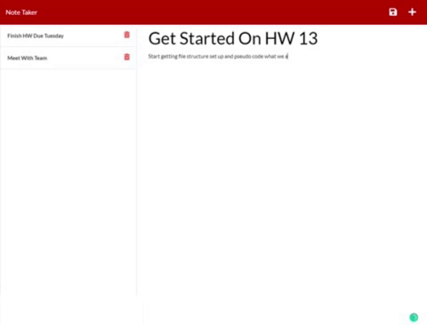
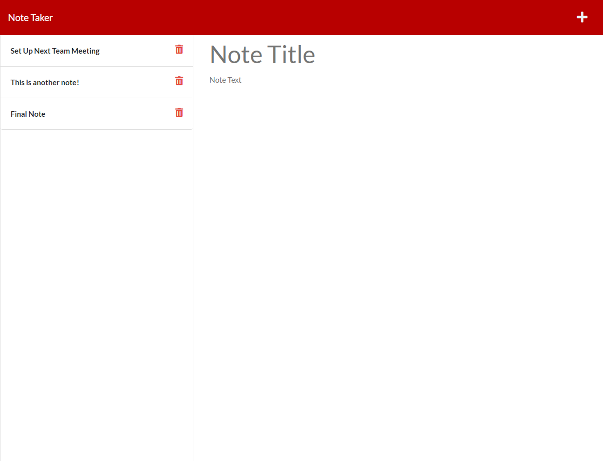
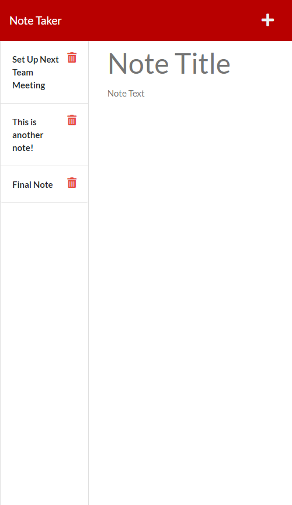

# Duly Noted

## Description

Looking for a simple to use to-do-list to keep your thoughts and tasks organized? Duly Noted has you covered. Duly Noted was created to make the process of making, tracking, and completing notes and tasks seamless, uncomplicated, and fun. 

No account needed, and no coding skills required. All you need to do is launch the application, and start taking notes or writing down your tasks. You can now easily create and delete notes/tasks without needing to navigate through any complicated user interface. Tired of the hassle required to use your current note-taker? Duly Noted was made for you.

If you are interested in improving or modifying this application for your own personal usage, please go ahead and clone down the repository and transform it into your own amazing note taking app.

[Link to deployed application on Heroku](https://duly-noted-application.herokuapp.com/)

[See video demo of app](https://drive.google.com/file/d/1KezRAG0xWhTEQ5Q-ACtTWt-8PVPh0mUg/view?usp=sharing)

## Table of Contents

- [Installation](#installation)
- [Usage](#usage)
- [Credits](#credits)
- [License](#license)
- [Features](#features)
- [Examples/Tests](#examples)

## Installation

- To install the app, make your way to the linked application on heroku or clone down the repository to your local machine.

## Usage

- To use the already hosted application, after making your way to the linked application hosted on heroku, all you need to is start taking notes!

- Alternatively, you can navigate to the cloned down repository, and run "node index.js" to launch the application.

Screenshots:

Desktop:

Mobile:

## Credits

Assets:

+ [express.js by express](https://expressjs.com/)

+ [uuid by uuid](https://github.com/uuidjs/uuid#readme)

Tutorials:

+ [Express.js Router and Routes](https://www.youtube.com/watch?v=iM_S4RczozU)

## License

+ MIT

## Features

+ User is initially presented with a clean homepage and an easy-to-understand note-taking page

+ User is able to enter notes/tasks that are populated to the list or notes/tasks on the left-side list column

+ User is also able to delete notes, should those notes/tasks become irrelevant and/or completed

+ User is also able to make GET/POST/DELETE requests using 3rd party apps like Insomnia or Postman

## How to Contribute

If you would like to contribute to the Duly Noted project, please feel free to clone or fork this repository and implement your desired improvements. Once your improvements have been made and the app has been tested properly, please feel free to send me a message on github with a short summary of the changes you've made and I will invite you to be a collaborator.

## Examples

To see an example for how to use this note-taking application, please refer to the video recording of the application in description section above.

## Questions

Connect with me on GitHub: [damienluzzo33](https://www.github.com/damienluzzo33)

Shoot me an email: [damienluzzo33@gmail.com](mailto:damienluzzo33@gmail.com)
